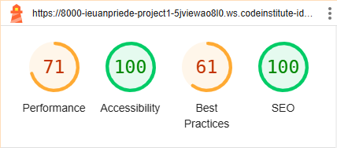
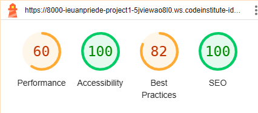
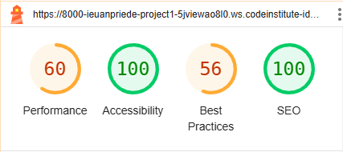
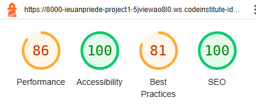
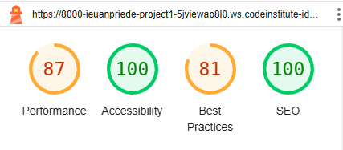

# The Roman Empire - Testing

Visit the deplyed side: [The Roman Empire] (https://ieuanpriede.github.io/Project-1/)

- - -

## Contents

* [AUTOMATED TESTING](#automated-testing)
  * [W3C Validator](#w3c-validator)
* [MANUAL TESTING](#manual-testing)
  * [Testing User Stories](#testing-user-stories)
  * [Full Testing](#full-testing)  

  Testing was ongoing throughout the entire build. I used the Inspect tool to ensure each page is resposive for different screen sizes.

  ## AUTOMATED TESTING

  ### W3C Validator

[W3C](https://validator.w3.org/) was used to validate the HTML on all pages of the website. It was also used to validate the CSS.

* [index.html](w3/index.html-validator.png) - Passed
* [timeline.html](w3/timeline.html-validator.png) - Passed
* [newsletter.html](w3/newsletter.html-validator.png) - Passed
* [subscribe.html](w3/subscribe.html-validator.png) - Passed

* [style.css](w3/style.css-validator.png) - Passed
* [style.css](assets/images/jigsawstyle.css.png) - Passed

### Lighthouse

I used Lighthouse within the Chrome Developer Tools to test the performance, accessibility, best practices and SEO of the website.

### Mobile Results 

### Desktop Results

## MANUAL TESTING

### Testing User Stories

`First Time Visitors`

| Goals | How are they achieved? |
| :--- | :--- |
| I want to be introduced to the history of the Roman Empire. | The Roman Empire site offers information to introduce the user to the Roman Empire. |
| I want digestible content as opposed to academic essays. | The content available is not too overwhelming and is easy to follow. |
| I want the site to be responsive to my device. | The Roman Empire site is responsive on all devices |
| I want the site to be easy to navigate. | The Roman Empire site is easy to navigate, with clearly visable buttons connecting the user to the pages they desire. |

`Returning Visitors`

|  Goals | How are they achieved? |
| :--- | :--- |
| I want to be able to find information that I previously encountered, to refresh my memory. | This site is easy to navigate through meaning a returning visitor can find the required information without difficulty. |

`Frequent Visitors`

| Goals | How are they achieved? |
| :--- | :--- |
| I want to ensure that I hold onto this new found information. | This site is easy to navigate through meaning a returning visitor can find the required information without difficulty. |
| I want to use this information to aid me with my projects/homework/studies. | This site is easy to navigate through meaning a returning visitor can find the required information without difficulty. |

- - -

### Full Testing

Full testing was performed on the following devices:

* Laptop:
  * Acer, Aspire A715-75G - 1920 x 1080 x 59 hertz
  * Macbook Pro
* Ipad, Tablet:
  * Ipad  
* Mobile Devices:
  * iPhone 12 mini
  

Each device tested the site using the following browsers:

* Google Chrome
* Safari

Tested using Acer, Aspire A715-75G:
* Firefox

Additional testing was taken by friends and family on a variety of devices and screen sizes. They reported no issues while visiting and navigating the site.

`Home Page`

| Feature | Expected Outcome | Testing Performed | Result | Pass/Fail |
| --- | --- | --- | --- | --- |
| The Sites title | Link directs the user back to the home page | Clicked title | Home page reloads | Pass |
| Home button | Refreshes the page as user is already on the Home page | Clicked on button | Refreshed screen | Pass |
| Timeline button | Sends user to the Timeline page | Clicked on Timeline button | Opens Timeline page | Pass |
| Newsletter button | Sends user to the Newsletter page | Clicked on Newsletter button | Opens Newsletter page | Pass |
| Facebook favicon | Sends user to the Facebook page | Clicked on Facebook favicon | Opens Facebook page | Pass |
| X favicon | Sends user to the X page | Clicked on X favicon | Opens X page | Pass |
| YouTube favicon | Sends user to the YouTube page | Clicked on YouTube favicon | Opens YouTube page | Pass |
| Instagram favicon | Sends user to the Instagram page | Clicked on Instagram favicon | Opens Instagram page | Pass |

`Timeline Page`

| Feature | Expected Outcome | Testing Performed | Result | Pass/Fail |
| --- | --- | --- | --- | --- |
| The Sites title | Link directs the user back to the home page | Clicked title | Home page reloads | Pass |
| Home button | Sends user to the Home page | Clicked on button | Opens Home page | Pass |
| Timeline button | Sends user to the Timeline page | Clicked on Timeline button | Opens Timeline page | Pass |
| Newsletter button | Sends user to the Newsletter page | Clicked on Newsletter button | Opens Newsletter page | Pass |
| Facebook favicon | Sends user to the Facebook page | Clicked on Facebook favicon | Opens Facebook page | Pass |
| X favicon | Sends user to the X page | Clicked on X favicon | Opens X page | Pass |
| YouTube favicon | Sends user to the YouTube page | Clicked on YouTube favicon | Opens YouTube page | Pass |
| Instagram favicon | Sends user to the Instagram page | Clicked on Instagram favicon | Opens Instagram page | Pass |

`Newsletter Page`

| Feature | Expected Outcome | Testing Performed | Result | Pass/Fail |
| --- | --- | --- | --- | --- |
| The Sites title | Link directs the user back to the home page | Clicked title | Home page reloads | Pass |
| Home button | Sends user to the Home page | Clicked on button | Opens Home page | Pass |
| Timeline button | Sends user to the Timeline page | Clicked on Timeline button | Opens Timeline page | Pass |
| Newsletter button | Sends user to the Newsletter page | Clicked on Newsletter button | Opens Newsletter page | Pass |
| Subscribe button | After inputting email address, user will be sent to Subscribe page | Entered valid email address & clicked on Subscribe button | Opens Subscribe page | Pass |
| Facebook favicon | Sends user to the Facebook page | Clicked on Facebook favicon | Opens Facebook page | Pass |
| X favicon | Sends user to the X page | Clicked on X favicon | Opens X page | Pass |
| YouTube favicon | Sends user to the YouTube page | Clicked on YouTube favicon | Opens YouTube page | Pass |
| Instagram favicon | Sends user to the Instagram page | Clicked on Instagram favicon | Opens Instagram page | Pass |

`Subscribe Page`

| Feature | Expected Outcome | Testing Performed | Result | Pass/Fail |
| --- | --- | --- | --- | --- |
| The Sites title | Link directs the user back to the home page | Clicked title | Home page reloads | Pass |
| Home button | Sends user to the Home page | Clicked on button | Opens Home page | Pass |
| Timeline button | Sends user to the Timeline page | Clicked on Timeline button | Opens Timeline page | Pass |
| Newsletter button | Sends user to the Newsletter page | Clicked on Newsletter button | Opens Newsletter page | Pass |
| Facebook favicon | Sends user to the Facebook page | Clicked on Facebook favicon | Opens Facebook page | Pass |
| X favicon | Sends user to the X page | Clicked on X favicon | Opens X page | Pass |
| YouTube favicon | Sends user to the YouTube page | Clicked on YouTube favicon | Opens YouTube page | Pass |
| Instagram favicon | Sends user to the Instagram page | Clicked on Instagram favicon | Opens Instagram page | Pass |